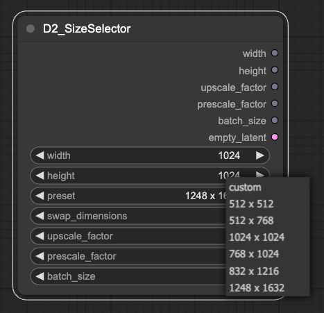

# D2 Size Selector

画像サイズのプリセットを簡単に呼び出し・設定できるカスタムノードです。
設定は同梱の `config.yaml` を編集することで行えます。

[Comfyroll Studio](https://github.com/Suzie1/ComfyUI_Comfyroll_CustomNodes) の `CR AspectRatio` ほぼそのままです。
プリセットを簡単に編集したかったので作りました。



## オプション説明

### width / height
画像サイズです。 `preset` が `custom` の時に採用されます。

### preset
画像サイズのプリセットです。
後述する `config.yaml` を編集することで自分の好きなサイズを設定できます。

### swap_dimensions
サイズの縦横を入れ替えます。

### upscale_factor
倍率を指定するノードで使えます。

### prescale_factor
ここで指定した倍率に変更します。

width: 1024
prescale_factor: 2
👉 width: 2048

### batch_size
バッチサイズを指定するノードで使えます。


## config.yaml

`ComfyUI/custom_nodes/ComfyUI_D2-size-selector/config.yaml` にサイズのプリセットを記述しています。

`preset name` がプリセット名です。好きな名前を付けられます。
`width pixel`、`height pixel` は画像サイズです。

```yaml
size_dict:
  preset name:
    width: {width pixel}
    height: {height pixel}
  512 x 512:
    width: 512
    height: 512
```

## 謝辞
Comfyroll Studio という素晴らしいカスタムノードを作ってくれた Suzie1 氏に感謝。
